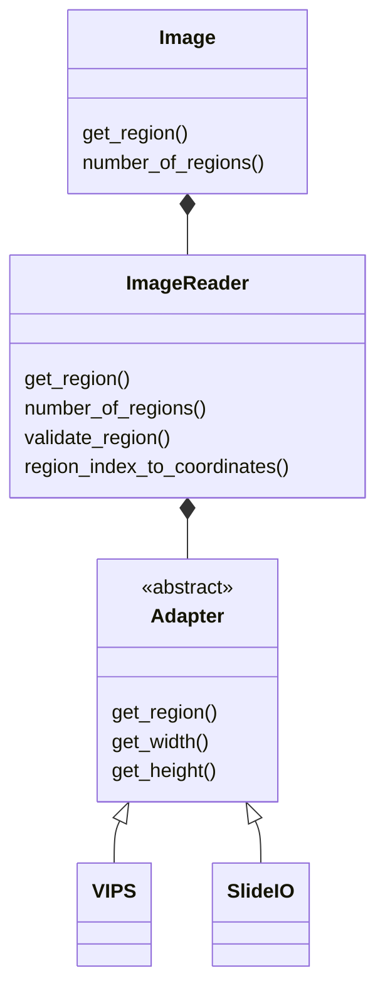

# UnifiedImageReader

## Installation

All of the dependencies for the adapters require manual installation because of the dll dependencies. Contact Adin at adinbsolomon@gmail.com with any questions.
